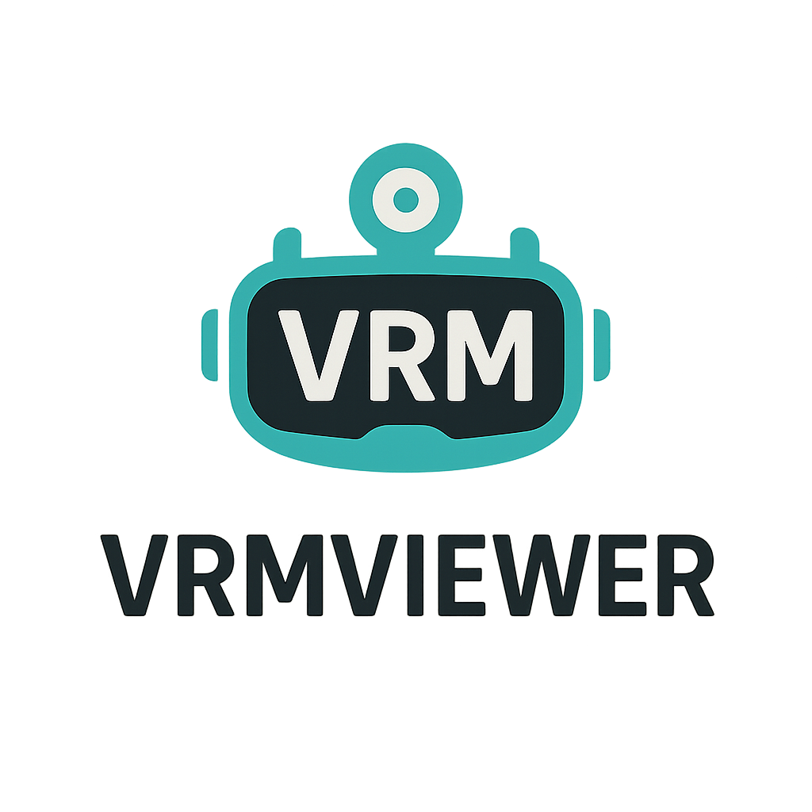
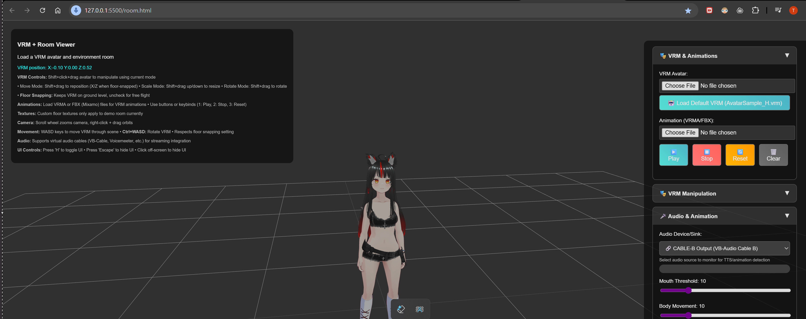

# 🎭 VRM Viewer + TTS Animation System

<div align="center">



 
 


**Real-time VRM avatar animation with intelligent TTS synchronization**

> **Built this specifically for AI projects that need proper avatar animation. Got tired of janky timing issues, so this uses deterministic TTS triggers instead of guessing from audio detection. Features real-time WebSocket communication, auto-loading VRM models, perfect animation sync, and manual controls. Soon I'll be integrating Tauri code and adding transparent background support so you can load your waifu directly on the desktop. Perfect foundation for AI companions, vtubing setups, or any project that needs reliable VRM animation.**



[🚀 Quick Start](#-quick-start) • [⚡ Features](#-features) • [🛠️ Setup](#️-setup) • [📚 Documentation](#-documentation)

</div>

---

## 🌟 Features

### 🎨 **VRM Avatar System**
- 🤖 **Auto-loading**: Default VRM model and animations on startup
- 🔄 **Real-time Animation**: Seamless idle ↔ talking state switching  
- 💬 **Mouth Animation**: Volume-based blend shapes with fine-tuned controls
- 🎮 **Interactive Controls**: Full camera and avatar manipulation
- 📁 **Multi-format Support**: VRM, FBX, VRMA, GLB, GLTF files

### 🗣️ **TTS Integration**  
- 🌐 **WebSocket Communication**: Zero-latency animation triggers
- ⚡ **Perfect Timing**: Server-side synchronization for precise animation
- 🎯 **Smart Detection**: Deterministic triggers, not audio guessing
- 🔧 **Optional Mode**: Works standalone without TTS server

### 🎮 **Controls & Interface**
- **Movement**: `WASD` (avatar), `Arrow Keys` (camera), `Mouse` (orbit)  
- **Manipulation**: `Ctrl+WASD` (rotation), `Shift+Drag` (positioning)
- **UI**: `H` (toggle interface), organized accordion panels
- **Animation**: Manual play/stop/reset controls

---

## 🚀 Quick Start

### ⚠️ **Critical: Web Server Required**

You **CANNOT** open `room.html` directly in browser. Use a web server:

#### 🎯 **VS Code Live Server** (Recommended)
```bash
1. Install "Live Server" extension
2. Right-click room.html → "Open with Live Server"  
3. Opens at http://127.0.0.1:5500/room.html
```

#### 🔄 **Alternative Servers**
```bash
# Python (built-in)
python -m http.server 8000
# → http://localhost:8000/room.html

# Node.js 
npx serve .
# → http://localhost:3000/room.html

# PHP
php -S localhost:8000
# → http://localhost:8000/room.html
```

**Why?** ES6 modules, CORS restrictions, and WebSocket context require HTTP protocol.

---

## ⚡ Usage Modes

### 🎭 **Standalone Mode** (No TTS Server)
1. Start web server
2. Open `room.html` 
3. **Auto-loads**:
   - Default VRM avatar (`AvatarSample_H.vrm`)
   - Idle animation (`Happy Idle.fbx`) 
   - Talking animation (`Talking.fbx`)
4. Use manual controls to trigger animations

### 🗣️ **TTS Integration Mode**  
1. Run TTS server: `run_gpt_sovits.bat`
2. Start web server and open `room.html`
3. Check "Enable TTS WebSocket Connection"  
4. Animations trigger automatically with TTS audio

---

## 🛠️ Setup

### 📁 **Project Structure**
```
VRMViewer/
├── room.html              # 🎯 Main application
├── api_v3.py             # 🔌 Modified TTS server  
├── run_gpt_sovits.bat    # 🚀 Server launcher
├── assets/
│   ├── models/           # 🤖 VRM avatar files
│   │   ├── AvatarSample_H.vrm
│   │   └── *.vrm
│   └── animations/       # 🎭 Animation files  
│       ├── Happy Idle.fbx
│       ├── Talking.fbx
│       └── *.fbx, *.vrma
├── js/                   # 📦 JavaScript modules
│   ├── three-vrm-core.module.js
│   ├── three-vrm-animation.module.js
│   └── loadMixamoAnimation.js
└── css/                  # 🎨 Styling
    └── styles.css
```

### 🔌 **TTS Server Integration** (Optional)

Our modified `api_v3.py` extends GPT-SoVITS with WebSocket animation signals:

#### **Key Modifications**
```python
# Real-time VRM communication
vrm_websocket = None

async def notify_vrm(message_type, text=None):
    if vrm_websocket:
        message = {"type": message_type}
        await vrm_websocket.send(json.dumps(message))

# Perfect timing integration
await notify_vrm("tts_start")  # Animation begins
await notify_vrm("tts_end")    # Return to idle
```

#### **Signal Protocol**
```json
{"type": "tts_start"}  // 🗣️ Start talking animation
{"type": "tts_end"}    // 😴 Return to idle animation  
```

### 📋 **Requirements**
- **Browser**: Chrome/Firefox/Edge with WebGL support
- **TTS Server**: GPT-SoVITS v2 Pro (optional)
- **Dependencies**: `websockets`, `asyncio` (for TTS integration)

---

## 🎯 Manual Animation Control

### 🎮 **Without TTS Server**
```javascript
// Browser console commands:
startIdleAnimation();           // 😴 Start idle 
startTalkingAnimationFromTTS(); // 🗣️ Start talking
stopAnimation();                // ⏹️ Stop current
resetAnimation();               // 🔄 Reset to idle
```

### 📁 **Custom Assets**
- **VRM Models**: Drop into `assets/models/` folder
- **Animations**: Support FBX (Mixamo) and VRMA formats  
- **Environments**: GLB/GLTF room files supported
- **Auto-retargeting**: Mixamo animations automatically fit VRM skeleton

---

## 🔧 Advanced Configuration

### 🎛️ **Animation Controls**
- **Mouth Gain**: Adjust lip-sync intensity (0.1 - 2.0)
- **Body Threshold**: Set talking animation trigger sensitivity  
- **Blend Shapes**: Utilizes VRM visemes (aa, ih, ou, ee, oh)

### 🌐 **WebSocket Settings**
- **Port**: 8765 (configurable in `api_v3.py`)
- **Auto-reconnect**: 5-second intervals on connection loss
- **Status Indicators**: Real-time connection status display

### 🎥 **Streaming Optimization**
- **OBS Compatible**: Optimized for broadcast software
- **Performance**: Hardware acceleration recommended
- **Audio Routing**: Support for virtual audio cables

---

## 🐛 Troubleshooting

| Problem | Solution |
|---------|----------|
| 🚫 Modules not loading | Use HTTP server, not `file://` protocol |
| 🔇 Audio not working | Check browser permissions & device selection |
| 👻 VRM not visible | Verify valid VRM file, check console errors |
| 🎭 Animations not playing | Confirm FBX/VRMA format, check VRM compatibility |
| 🔌 TTS connection failed | Verify `api_v3.py` server running on port 8765 |

---

## 🚀 Performance Tips

- ✅ **Enable hardware acceleration** in browser settings
- ✅ **Use Chrome/Edge** for best WebGL performance  
- ✅ **Disable unused features** (spring bones, etc.) if lag occurs
- ✅ **Local server** recommended over network drives
- ✅ **Close unused browser tabs** for optimal performance

---

## 🎓 Technical Architecture

### 🏗️ **Built With**
- **Three.js r169**: 3D rendering engine
- **VRM 3.0**: Avatar standard support  
- **WebSocket**: Real-time communication
- **ES6 Modules**: Clean import system
- **Web Audio API**: Advanced audio processing

### ⚡ **Why This Approach Works**
- **Deterministic Timing**: TTS server knows exact audio timing
- **Zero Latency**: No audio detection delays  
- **Universal Compatibility**: Works regardless of user audio setup
- **Reliable Synchronization**: No false positives or missed triggers

---

## 📄 License & Credits

**Built with**:
- 🎯 Three.js + VRM Libraries  
- 🤖 VRM Consortium sample assets
- 🎭 Mixamo animation library
- 🗣️ GPT-SoVITS TTS framework

---

<div align="center">

**🎭 Professional VRM Animation System**

*Real-time • Deterministic • Production-Ready*

[](https://threejs.org/)
[](https://developer.mozilla.org/en-US/docs/Web/API/WebSocket)

</div>